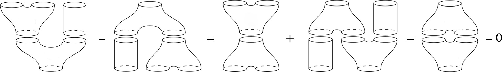

## Usage

<code>[CanonicalLieBialgebra]()[*pairing*]</code> is the dIBL algebra of cyclic words over the alphabet of *pairing*.

<!-- #| annotation: 26.09.30: Design review - CanonicalLieBialgebra is an inert object around one Association, CanonicalLieBialgebra[<|"Pairing" -> pairing, "EmptyWord" -> b|>], and it has no recognizer (decision of R5e, 2026-09-30). The constructor returns unevaluated unless it is given a GradedPairing object and a Boolean empty-word option, so that a constructor that built nothing does not look like an object, and the summary box attaches only to the built one. Since R7 (Pavel, 2026-10-01) the built object is recognized by its data, an Association with a "Pairing" holding a GradedPairing and an "EmptyWord" holding True or False, in every rule that takes it, and not by its head alone: CanonicalLieBialgebra[Normal[pairing]] matched CanonicalLieBialgebra[_Association] before, and Relations answered on it. The empty word is set once, on the algebra, and the Obstruction forms on it take no option. The algebra is the structure that Obstruction, Relations and RelationsQ take; those three are declared in HomotopyAlgebras with their A-infinity rules, and ChernSimons adds the rules of the string algebra, so the dependency between the parts runs one way. Together they replaced thirteen exports, every obstruction identical by value to the one it replaced on 95 cases. Prior art: the Wolfram Language has no dIBL or involutive bi-Lie structures; the verification suites test the relations on the circle in both conventions and with the empty word, on the two nilmanifold alphabets and on a derived alphabet. -->

## Details & Options

- The operations of the algebra are [CanonicalLieBracket](), [CanonicalLieCobracket]() and [CyclicHochschildDifferential](), in the convention of *pairing*.
- The algebra is the structure that [Obstruction](), [Relations]() and [RelationsQ]() take.
- Its relations are `"Jacobi"` on three words, `"CoJacobi"` on one, `"Drinfeld"` on two and `"Involutivity"` on one, the defining identities of an involutive bi-Lie algebra. They involve the bracket and the co-bracket.
- The result is an object <code>[CanonicalLieBialgebra]()[*assoc*]</code>, with the keys `"Pairing"` and `"EmptyWord"` in *assoc*. For such an algebra *a*:

| Form | Value |
|---|---|
| <code>*a*["Pairing"]</code> | the pairing |
| <code>*a*["EmptyWord"]</code> | `True` or `False` |

- [Obstruction](), [Relations](), [RelationsQ](), the accessors and the summary box answer only when *assoc* has a `"Pairing"` holding a [GradedPairing]() object and an `"EmptyWord"` holding `True` or `False`.
- The algebra displays as a summary box: the alphabet and whether the empty word is in, with the convention, the degree and the degrees of the letters under the opener.
- [CanonicalLieBialgebra]() has the following option:

| Option | Default | Description |
|---|---|---|
| <code>"EmptyWord"</code> | <code>False</code> | whether the algebra is extended by the empty word |

- With `"EmptyWord" -> True` every operation the relations are built from computes with that option.
- A pairing that is not a [GradedPairing]() object, or an option value that is not `True` or `False`, returns unevaluated.

## Basic Examples

A glued surface is a composition of the operations, the cylinder being the identity; summing over all insertions of the incoming strings and all compositions gives the relations, here the involutivity relation, the bracket of the two halves of a cut string vanishing:



The canonical Lie bialgebra of the circle:

```wl
CanonicalLieBialgebra[GradedPairing[<|x -> -1, y -> 0|>, <|{x, y} -> 1|>]]
```

<!-- => a CanonicalLieBialgebra object over the alphabet x, y, without the empty word -->

---

The canonical Lie bialgebra of the circle:

```wl
algebra = CanonicalLieBialgebra[GradedPairing[<|x -> -1, y -> 0|>, <|{x, y} -> 1|>]]
```

<!-- => a CanonicalLieBialgebra object over the alphabet x, y, without the empty word -->

Its relations and their arities:

```wl
Relations[algebra]
```

<!-- => <|"Jacobi" -> 3, "CoJacobi" -> 1, "Drinfeld" -> 2, "Involutivity" -> 1|> -->

The relations hold on all words of length at most $3$:

```wl
RelationsQ[algebra, 3]
```

<!-- => True -->

## Scope

The alphabet of the circle in the exterior picture:

```wl
exterior = Append[GradedPairing[<|x -> -1, y -> 0|>, <|{x, y} -> 1|>], "Convention" -> "Exterior"]
```

<!-- => a GradedPairing object with letters x and y, of pairing degree -1, in the exterior convention -->

In the exterior convention the relations are computed with exterior products:

```wl
Obstruction[CanonicalLieBialgebra[exterior], "Jacobi", {CyclicWord[{x}], CyclicWord[{x, y}], CyclicWord[{y, y}]}]
```

<!-- => 0 -->

---

A three-letter alphabet:

```wl
three = GradedPairing[<|p -> -1, q -> 0, r -> -1|>, <|{p, q} -> 1, {r, q} -> 1|>]
```

<!-- => a GradedPairing object with letters p, q and r, of pairing degree -1 -->

The relations of its algebra with the empty word hold on all words of length at most $2$:

```wl
RelationsQ[CanonicalLieBialgebra[three, "EmptyWord" -> True], 2]
```

<!-- => True -->

## Options

### EmptyWord

The alphabet of the circle:

```wl
pairing = GradedPairing[<|x -> -1, y -> 0|>, <|{x, y} -> 1|>]
```

<!-- => a GradedPairing object with letters x and y, of pairing degree -1 -->

The algebra extended by the empty word:

```wl
algebra = CanonicalLieBialgebra[pairing, "EmptyWord" -> True]
```

<!-- => a CanonicalLieBialgebra object over the alphabet x, y, with the empty word -->

It reads back its empty-word setting:

```wl
algebra["EmptyWord"]
```

<!-- => True -->

And its pairing:

```wl
algebra["Pairing"] === pairing
```

<!-- => True -->

## Properties and Relations

The alphabet of the circle:

```wl
pairing = GradedPairing[<|x -> -1, y -> 0|>, <|{x, y} -> 1|>]
```

<!-- => a GradedPairing object with letters x and y, of pairing degree -1 -->

The co-Jacobi obstruction of the algebra with the empty word is the co-bracket applied twice with the option `"EmptyWord" -> True`:

```wl
Obstruction[CanonicalLieBialgebra[pairing, "EmptyWord" -> True], "CoJacobi", {{x, x, y, y}}] === Expand[CanonicalLieCobracket[CanonicalLieCobracket[{x, x, y, y}, pairing, "EmptyWord" -> True], pairing, "EmptyWord" -> True]]
```

<!-- => True -->

## Possible Issues

The alphabet of the circle:

```wl
pairing = GradedPairing[<|x -> -1, y -> 0|>, <|{x, y} -> 1|>]
```

<!-- => a GradedPairing object with letters x and y, of pairing degree -1 -->

An option value that is not `True` or `False` returns unevaluated:

```wl
CanonicalLieBialgebra[pairing, "EmptyWord" -> 1]
```

<!-- => the input with the pairing in place, unevaluated -->

---

The alphabet of the circle:

```wl
pairing = GradedPairing[<|x -> -1, y -> 0|>, <|{x, y} -> 1|>]
```

<!-- => a GradedPairing object with letters x and y, of pairing degree -1 -->

The Association of the data of a pairing is not a pairing object, and returns unevaluated:

```wl
CanonicalLieBialgebra[Normal[pairing]]
```

<!-- => CanonicalLieBialgebra of the Association of the data of the pairing, unevaluated and with no summary box -->

It has no relations, since it holds no pairing object:

```wl
Relations[CanonicalLieBialgebra[Normal[pairing]]]
```

<!-- => the input with the Association in place, unevaluated -->
