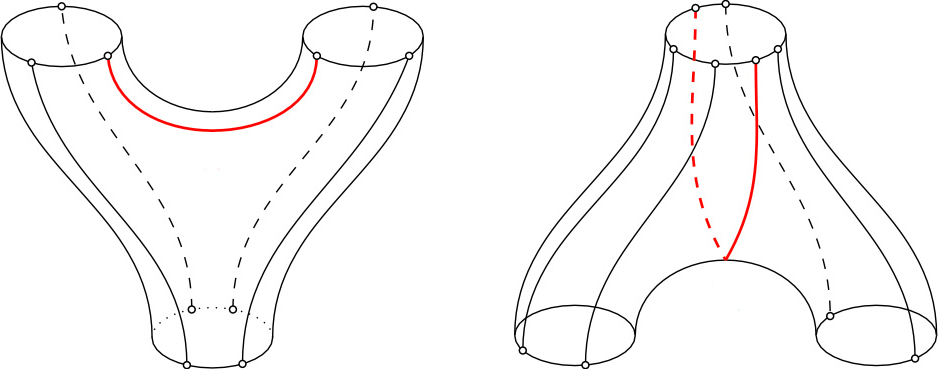

## Usage

<code>[CanonicalLieCobracket]()[*w*, *pairing*]</code> gives the co-bracket of the cyclic word *w*, a product of two cyclic words, in the convention of *pairing*.

<code>[CanonicalLieCobracket]()[*p*, *pairing*]</code> gives the extension of the co-bracket as a co-derivation, applied to a product *p* of cyclic words.

<!-- #| annotation: 26.09.30: Design review - the co-bracket is one half of the sum of ChordContraction over every ordered pair of distinct positions, so each chord is counted once in each orientation, and ChordContraction is exported as the term it shares with the bracket. The function reads the degrees, the pairing values and the convention off the GradedPairing object and carries its own linearity rules, so the co-bracket of a signed product, the natural output of the products, composes with itself without a wrapper. On a single cyclic word the extension is the co-bracket itself, so there is one function and not two. A product whose head disagrees with the convention of the pairing returns unevaluated rather than being coerced, since the "Convention" key is the one switch between the pictures (decision of 2026-09-21). Alternative name considered: InvolutiveCobracket, the name until 2026-09-30. Prior art: the Wolfram Language has no cyclic words or involutive bi-Lie structures; the engine the verification suites load computes the same co-bracket from letter strings and pins this function on every word to length 7, and the empty-word extension against the empty-word engine on every word to length 7. -->

## Details & Options

- The co-bracket is the operation $\mathfrak{q}_{1,2,0}$ of the involutive bi-Lie structure. It takes one cyclic word to a product of two, cutting the word at a pair of particles and contracting the two particles against the pairing.
- The co-bracket is one half of the sum of [ChordContraction]() over every ordered pair of distinct positions.
- The convention of *pairing* selects the picture: the result is a [SymmetricProduct]() under `"Symmetric"` and an [ExteriorProduct]() under `"Exterior"`.
- A word too short to be cut in two, or one whose cuts all cancel, has co-bracket $0$. Over the alphabet of the circle the first nonzero co-bracket is in length $4$.
- In the second form the co-bracket is applied to each factor of *p* in turn, with the Koszul sign of the shuffle that brings it to the front, and the other factors are carried along. The extension raises the number of factors by one.
- Both forms are linear: they distribute over sums and pull out scalars.
- A word may be given as the list of its particles.
- A product whose head disagrees with the convention of *pairing* returns unevaluated.
- [CanonicalLieCobracket]() has the following option:

| Option | Default | Description |
|---|---|---|
| <code>"EmptyWord"</code> | <code>False</code> | whether a cut next to a contracted particle is kept, with the empty word <code>[CyclicWord]()[{}]</code> as its empty arc |

- With `"EmptyWord" -> False` only cuts with two nonempty arcs count, which is the positive-length convention. With `"EmptyWord" -> True` the co-bracket is that of the empty-word extension.
- The co-bracket of the empty word is $0$ in both conventions.
- The identities of the co-bracket, `"CoJacobi"`, `"Drinfeld"` and `"Involutivity"`, are relations of the [CanonicalLieBialgebra]() of *pairing*, computed by [Obstruction]().

## Basic Examples

The co-bracket, on the right, cuts one string into two; the strings propagate from the top to the bottom, and the red curve is the pairing that annihilates two particles of the word:



The first nonzero co-bracket over the alphabet of the circle:

```wl
CanonicalLieCobracket[CyclicWord[{x, y, y, y}], GradedPairing[<|x -> -1, y -> 0|>, <|{x, y} -> 1|>]]
```

<!-- => -SymmetricProduct[CyclicWord[{y}], CyclicWord[{y}]] -->

---

A word too short to cut has co-bracket $0$:

```wl
CanonicalLieCobracket[CyclicWord[{x, y}], GradedPairing[<|x -> -1, y -> 0|>, <|{x, y} -> 1|>]]
```

<!-- => 0 -->

---

In the exterior picture the result is an [ExteriorProduct]():

```wl
CanonicalLieCobracket[CyclicWord[{x, y, y, y}], Append[GradedPairing[<|x -> -1, y -> 0|>, <|{x, y} -> 1|>], "Convention" -> "Exterior"]]
```

<!-- => ExteriorProduct[CyclicWord[{y}], CyclicWord[{y}]] -->

## Scope

The alphabet of the circle:

```wl
pairing = GradedPairing[<|x -> -1, y -> 0|>, <|{x, y} -> 1|>]
```

<!-- => a GradedPairing object with particles x and y, of pairing degree -1 -->

Among the words of length at most $5$, only two have a nonzero co-bracket:

```wl
DeleteCases[(# -> CanonicalLieCobracket[#, pairing] &) /@ GenerateCyclicWords[5, pairing, "UpTo" -> True], _ -> 0]
```

<!-- => {CyclicWord[{x, y, y, y}] -> -SymmetricProduct[CyclicWord[{y}], CyclicWord[{y}]], CyclicWord[{x, y, y, y, y}] -> -2 SymmetricProduct[CyclicWord[{y}], CyclicWord[{y, y}]]} -->

The co-derivation extension raises the number of factors by one:

```wl
CanonicalLieCobracket[SymmetricProduct[CyclicWord[{y}], CyclicWord[{x, y, y, y}], pairing], pairing]
```

<!-- => -SymmetricProduct[CyclicWord[{y}], CyclicWord[{y}], CyclicWord[{y}]] -->

A word may be given as the list of its particles:

```wl
CanonicalLieCobracket[{x, y, y, y}, pairing]
```

<!-- => -SymmetricProduct[CyclicWord[{y}], CyclicWord[{y}]] -->

The extension is linear:

```wl
CanonicalLieCobracket[2 CyclicWord[{x, y, y, y}] - kappa CyclicWord[{x, y, y, y, y}], pairing]
```

<!-- => -2 SymmetricProduct[CyclicWord[{y}], CyclicWord[{y}]] + 2 kappa SymmetricProduct[CyclicWord[{y}], CyclicWord[{y, y}]] -->

## Options

### EmptyWord

The alphabet of the circle:

```wl
pairing = GradedPairing[<|x -> -1, y -> 0|>, <|{x, y} -> 1|>]
```

<!-- => a GradedPairing object with particles x and y, of pairing degree -1 -->

With the empty word kept, the shortest word has a nonzero co-bracket:

```wl
CanonicalLieCobracket[{x, y}, pairing, "EmptyWord" -> True]
```

<!-- => -SymmetricProduct[CyclicWord[{}], CyclicWord[{}]] -->

The cuts next to the contracted particles add to the co-bracket of $xyyy$:

```wl
CanonicalLieCobracket[{x, y, y, y}, pairing, "EmptyWord" -> True]
```

<!-- => -2 SymmetricProduct[CyclicWord[{}], CyclicWord[{y, y}]] - SymmetricProduct[CyclicWord[{y}], CyclicWord[{y}]] -->

## Properties and Relations

The co-Jacobi identity holds on every word of length at most $5$:

```wl
DeleteDuplicates[(w |-> Obstruction[CanonicalLieBialgebra[GradedPairing[<|x -> -1, y -> 0|>, <|{x, y} -> 1|>]], "CoJacobi", {w}]) /@ GenerateCyclicWords[5, GradedPairing[<|x -> -1, y -> 0|>, <|{x, y} -> 1|>], "UpTo" -> True]]
```

<!-- => {0} -->

---

Involutivity, the bracket after the co-bracket, holds on every word of length at most $5$:

```wl
DeleteDuplicates[(w |-> Obstruction[CanonicalLieBialgebra[GradedPairing[<|x -> -1, y -> 0|>, <|{x, y} -> 1|>]], "Involutivity", {w}]) /@ GenerateCyclicWords[5, GradedPairing[<|x -> -1, y -> 0|>, <|{x, y} -> 1|>], "UpTo" -> True]]
```

<!-- => {0} -->

---

The alphabet of the circle:

```wl
pairing = GradedPairing[<|x -> -1, y -> 0|>, <|{x, y} -> 1|>]
```

<!-- => a GradedPairing object with particles x and y, of pairing degree -1 -->

The symmetric co-bracket of $xyyy$, sent to the exterior picture by [SymmetricToExterior]():

```wl
SymmetricToExterior[CanonicalLieCobracket[CyclicWord[{x, y, y, y}], pairing], pairing]
```

<!-- => ExteriorProduct[CyclicWord[{y}], CyclicWord[{y}]] -->

It is the exterior co-bracket:

```wl
CanonicalLieCobracket[CyclicWord[{x, y, y, y}], Append[pairing, "Convention" -> "Exterior"]]
```

<!-- => ExteriorProduct[CyclicWord[{y}], CyclicWord[{y}]] -->

---

The alphabet of the circle:

```wl
pairing = GradedPairing[<|x -> -1, y -> 0|>, <|{x, y} -> 1|>]
```

<!-- => a GradedPairing object with particles x and y, of pairing degree -1 -->

The co-bracket of $xyyyy$ is a signed product:

```wl
CanonicalLieCobracket[CyclicWord[{x, y, y, y, y}], pairing]
```

<!-- => -2 SymmetricProduct[CyclicWord[{y}], CyclicWord[{y, y}]] -->

Since the extension is linear it applies again, and the co-Jacobi identity says the result is $0$:

```wl
CanonicalLieCobracket[CanonicalLieCobracket[CyclicWord[{x, y, y, y, y}], pairing], pairing]
```

<!-- => 0 -->

## Possible Issues

The alphabet of the circle:

```wl
pairing = GradedPairing[<|x -> -1, y -> 0|>, <|{x, y} -> 1|>]
```

<!-- => a GradedPairing object with particles x and y, of pairing degree -1 -->

A symmetric product under an exterior pairing returns unevaluated, since the extension is defined for a [SymmetricProduct]() under `"Symmetric"` and for an [ExteriorProduct]() under `"Exterior"`:

```wl
CanonicalLieCobracket[SymmetricProduct[CyclicWord[{y}], CyclicWord[{x, y, y, y}], pairing], Append[pairing, "Convention" -> "Exterior"]]
```

<!-- => the input with the exterior pairing in place, unevaluated -->
